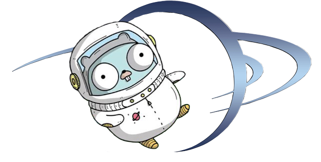

[](https://discord.gg/4dZtZpz)

# OGame automation toolkit

- [As a library](#ogame-library)
- [As a service (ogamed)](#ogamed-service)
- [As a docker container](#docker-container)

---

Discord: https://discord.gg/4dZtZpz

---

How to migrate to v48 : https://github.com/alaingilbert/ogame/wiki/Migration-to-v48

---

# ogame library

### Verify attack example

```go
package main

import "fmt"
import "os"
import "github.com/alaingilbert/ogame/pkg/ogame"
import "github.com/alaingilbert/ogame/pkg/wrapper"

func main() {
	universe := os.Getenv("UNIVERSE") // eg: Bellatrix
	username := os.Getenv("USERNAME") // eg: email@gmail.com
	password := os.Getenv("PASSWORD") // eg: *****
	language := os.Getenv("LANGUAGE") // eg: en
	bot, err := wrapper.New(universe, username, password, language)
	if err != nil {
		panic(err)
	}
	attacked, _ := bot.IsUnderAttack()
	fmt.Println(attacked) // False
}
```

### Calculate building time example

```go
package main

import "github.com/alaingilbert/ogame/pkg/ogame"
import "fmt"

func main() {
	level := int64(5)
	universeSpeed := int64(1)
	hasTechnocrat := false
	isDiscoverer := false
	facilities := ogame.Facilities{RoboticsFactory: 10, NaniteFactory: 2}
	duration := ogame.MetalMine.ConstructionTime(level, universeSpeed, facilities, hasTechnocrat, isDiscoverer)
	fmt.Println("Building time:", duration)
	
	// OR if you want to know the construction time for anything that can be built, using an ID
	id := ogame.MetalMineID
	duration := ogame.Objs.ByID(id).ConstructionTime(level, universeSpeed, facilities, hasTechnocrat, isDiscoverer)
	fmt.Println("Building time:", duration)
}
```

##### How to get started

- Ensure you have go 1.18 or above `go version`
- Copy and paste the above example in a file `main.go`
- Create your own module `go mod init my_project`
- Install dependencies `go mod vendor`
- Run the code `go run main.go`

### Available methods

```go
AddAccount(number int, lang string) (*AddAccountRes, error)
BytesDownloaded() int64
BytesUploaded() int64
CharacterClass() ogame.CharacterClass
ConstructionTime(id ogame.ID, nbr int64, facilities ogame.Facilities) time.Duration
Disable()
Distance(origin, destination ogame.Coordinate) int64
Enable()
FleetDeutSaveFactor() float64
GetCachedCelestial(any) Celestial
GetCachedCelestials() []Celestial
GetCachedMoons() []Moon
GetCachedPlanets() []Planet
GetCachedPlayer() ogame.UserInfos
GetCachedPreferences() ogame.Preferences
GetClient() *OGameClient
GetExtractor() extractor.Extractor
GetLanguage() string
GetNbSystems() int64
GetPublicIP() (string, error)
GetResearchSpeed() int64
GetServer() Server
GetServerData() ServerData
GetSession() string
GetState() (bool, string)
GetTasks() taskRunner.TasksOverview
GetUniverseName() string
GetUniverseSpeed() int64
GetUniverseSpeedFleet() int64
GetUsername() string
IsConnected() bool
IsDonutGalaxy() bool
IsDonutSystem() bool
IsEnabled() bool
IsLocked() bool
IsLoggedIn() bool
IsPioneers() bool
IsV7() bool
IsV9() bool
IsVacationModeEnabled() bool
Location() *time.Location
OnStateChange(clb func(locked bool, actor string))
Quiet(bool)
ReconnectChat() bool
RegisterAuctioneerCallback(func(any))
RegisterChatCallback(func(ChatMsg))
RegisterHTMLInterceptor(func(method, url string, params, payload url.Values, pageHTML []byte))
RegisterWSCallback(string, func([]byte))
RemoveWSCallback(string)
ServerURL() string
ServerVersion() string
SetClient(*OGameClient)
SetGetServerDataWrapper(func(func() (ServerData, error)) (ServerData, error))
SetLoginWrapper(func(func() (bool, error)) error)
SetOGameCredentials(username, password, otpSecret, bearerToken string)
SetProxy(proxyAddress, username, password, proxyType string, loginOnly bool, config *tls.Config) error
SetUserAgent(newUserAgent string)
ValidateAccount(code string) error
WithPriority(priority taskRunner.Priority) Prioritizable

Abandon(any) error
ActivateItem(string, ogame.CelestialID) error
Begin() Prioritizable
BeginNamed(name string) Prioritizable
BuyMarketplace(itemID int64, celestialID ogame.CelestialID) error
BuyOfferOfTheDay() error
CancelFleet(ogame.FleetID) error
CollectAllMarketplaceMessages() error
CollectMarketplaceMessage(ogame.MarketplaceMessage) error
CreateUnion(fleet ogame.Fleet, unionUsers []string) (int64, error)
DeleteAllMessagesFromTab(tabID ogame.MessagesTabID) error
DeleteMessage(msgID int64) error
DoAuction(bid map[ogame.CelestialID]ogame.Resources) error
Done()
FlightTime(origin, destination ogame.Coordinate, speed ogame.Speed, ships ogame.ShipsInfos, mission ogame.MissionID) (secs, fuel int64)
GalaxyInfos(galaxy, system int64, opts ...Option) (ogame.SystemInfos, error)
GetActiveItems(ogame.CelestialID) ([]ogame.ActiveItem, error)
GetAllResources() (map[ogame.CelestialID]ogame.Resources, error)
GetAttacks(...Option) ([]ogame.AttackEvent, error)
GetAuction() (ogame.Auction, error)
GetCachedResearch() ogame.Researches
GetCelestial(any) (Celestial, error)
GetCelestials() ([]Celestial, error)
GetCombatReportSummaryFor(ogame.Coordinate) (ogame.CombatReportSummary, error)
GetDMCosts(ogame.CelestialID) (ogame.DMCosts, error)
GetEmpire(ogame.CelestialType) ([]ogame.EmpireCelestial, error)
GetEmpireJSON(nbr int64) (any, error)
GetEspionageReport(msgID int64) (ogame.EspionageReport, error)
GetEspionageReportFor(ogame.Coordinate) (ogame.EspionageReport, error)
GetEspionageReportMessages() ([]ogame.EspionageReportSummary, error)
GetExpeditionMessageAt(time.Time) (ogame.ExpeditionMessage, error)
GetExpeditionMessages() ([]ogame.ExpeditionMessage, error)
GetFleets(...Option) ([]ogame.Fleet, ogame.Slots)
GetFleetsFromEventList() []ogame.Fleet
GetItems(ogame.CelestialID) ([]ogame.Item, error)
GetMoon(any) (Moon, error)
GetMoons() []Moon
GetPageContent(url.Values) ([]byte, error)
GetPlanet(any) (Planet, error)
GetPlanets() []Planet
GetResearch() ogame.Researches
GetSlots() ogame.Slots
GetUserInfos() ogame.UserInfos
HeadersForPage(url string) (http.Header, error)
Highscore(category, typ, page int64) (v6.Highscore, error)
IsUnderAttack() (bool, error)
Login() error
LoginWithBearerToken(token string) (bool, error)
LoginWithExistingCookies() (bool, error)
Logout()
OfferBuyMarketplace(itemID any, quantity, priceType, price, priceRange int64, celestialID ogame.CelestialID) error
OfferSellMarketplace(itemID any, quantity, priceType, price, priceRange int64, celestialID ogame.CelestialID) error
PostPageContent(url.Values, url.Values) ([]byte, error)
RecruitOfficer(typ, days int64) error
SendMessage(playerID int64, message string) error
SendMessageAlliance(associationID int64, message string) error
ServerTime() time.Time
SetInitiator(initiator string) Prioritizable
SetVacationMode() error
Tx(clb func(tx Prioritizable) error) error
UseDM(string, ogame.CelestialID) error

// Planet or Moon functions
Build(celestialID ogame.CelestialID, id ogame.ID, nbr int64) error
BuildBuilding(celestialID ogame.CelestialID, buildingID ogame.ID) error
BuildCancelable(ogame.CelestialID, ogame.ID) error
BuildDefense(celestialID ogame.CelestialID, defenseID ogame.ID, nbr int64) error
BuildProduction(celestialID ogame.CelestialID, id ogame.ID, nbr int64) error
BuildShips(celestialID ogame.CelestialID, shipID ogame.ID, nbr int64) error
BuildTechnology(celestialID ogame.CelestialID, technologyID ogame.ID) error
CancelBuilding(ogame.CelestialID) error
CancelResearch(ogame.CelestialID) error
ConstructionsBeingBuilt(ogame.CelestialID) (buildingID ogame.ID, buildingCountdown int64, researchID ogame.ID, researchCountdown int64)
EnsureFleet(celestialID ogame.CelestialID, ships []ogame.Quantifiable, speed ogame.Speed, where ogame.Coordinate, mission ogame.MissionID, resources ogame.Resources, holdingTime, unionID int64) (ogame.Fleet, error)
GetDefense(ogame.CelestialID, ...Option) (ogame.DefensesInfos, error)
GetFacilities(ogame.CelestialID, ...Option) (ogame.Facilities, error)
GetProduction(ogame.CelestialID) ([]ogame.Quantifiable, int64, error)
GetResources(ogame.CelestialID) (ogame.Resources, error)
GetResourcesBuildings(ogame.CelestialID, ...Option) (ogame.ResourcesBuildings, error)
GetResourcesDetails(ogame.CelestialID) (ogame.ResourcesDetails, error)
GetShips(ogame.CelestialID, ...Option) (ogame.ShipsInfos, error)
GetTechs(celestialID ogame.CelestialID) (ogame.ResourcesBuildings, ogame.Facilities, ogame.ShipsInfos, ogame.DefensesInfos, ogame.Researches, error)
SendFleet(celestialID ogame.CelestialID, ships []ogame.Quantifiable, speed ogame.Speed, where ogame.Coordinate, mission ogame.MissionID, resources ogame.Resources, holdingTime, unionID int64) (ogame.Fleet, error)
TearDown(celestialID ogame.CelestialID, id ogame.ID) error

// Planet specific functions
DestroyRockets(ogame.PlanetID, int64, int64) error
GetResourceSettings(ogame.PlanetID, ...Option) (ogame.ResourceSettings, error)
GetResourcesProductions(ogame.PlanetID) (ogame.Resources, error)
GetResourcesProductionsLight(ogame.ResourcesBuildings, ogame.Researches, ogame.ResourceSettings, ogame.Temperature) ogame.Resources
SendIPM(ogame.PlanetID, ogame.Coordinate, int64, ogame.ID) (int64, error)
SetResourceSettings(ogame.PlanetID, ogame.ResourceSettings) error

// Moon specific functions
JumpGate(origin, dest ogame.MoonID, ships ogame.ShipsInfos) (bool, int64, error)
JumpGateDestinations(origin ogame.MoonID) ([]ogame.MoonID, int64, error)
Phalanx(ogame.MoonID, ogame.Coordinate) ([]ogame.Fleet, error)
UnsafePhalanx(ogame.MoonID, ogame.Coordinate) ([]ogame.Fleet, error)
```

### Full documentation

[https://godoc.org/github.com/alaingilbert/ogame](https://godoc.org/github.com/alaingilbert/ogame)

---

# ogamed service

Download [ogamed binary here](https://github.com/alaingilbert/ogame/releases)  
Full documentation [here](https://github.com/alaingilbert/ogame/wiki/ogamed-full-documentation)

```
./ogamed --universe=Zibal --username=email@email.com --password=secret --language=en
```

```
$ curl 127.0.0.1:8080/bot/is-under-attack
{"Status":"ok","Code":200,"Message":"","Result":false}

$ curl 127.0.0.1:8080/bot/send-message -d 'playerID=123&message="Sup boi!"'
{"Status":"ok","Code":200,"Message":"","Result":null}

$ curl 127.0.0.1:8080/bot/user-infos
{"Status":"ok","Code":200,"Message":"","Result":{"PlayerID":106734,"PlayerName":"Commodore Nomad","Points":43825,"Rank":1130,"Total":1675,"HonourPoints":0}}
```

```
POST /bot/set-user-agent
GET  /bot/server-url
POST /bot/page-content
GET  /bot/login
GET  /bot/logout
GET  /bot/server/speed
GET  /bot/server/version
GET  /bot/server/time
GET  /bot/is-under-attack
GET  /bot/user-infos
POST /bot/send-message
GET  /bot/fleets
POST /bot/fleets/:fleetID/cancel
POST /bot/delete-report/:messageID
POST /bot/delete-all-espionage-reports
POST /bot/delete-all-reports/:tabIndex
GET  /bot/attacks
GET  /bot/galaxy-infos/:galaxy/:system
GET  /bot/get-research
GET  /bot/price/:ogameID/:nbr
GET  /bot/planets
GET  /bot/planets/:galaxy/:system/:position
GET  /bot/planets/:planetID
GET  /bot/planets/:planetID/resource-settings
POST /bot/planets/:planetID/resource-settings
GET  /bot/planets/:planetID/resources-buildings
GET  /bot/planets/:planetID/defence
GET  /bot/planets/:planetID/ships
GET  /bot/planets/:planetID/facilities
POST /bot/planets/:planetID/build/:ogameID/:nbr
POST /bot/planets/:planetID/build/cancelable/:ogameID
POST /bot/planets/:planetID/build/production/:ogameID/:nbr
POST /bot/planets/:planetID/build/building/:ogameID
POST /bot/planets/:planetID/build/technology/:ogameID
POST /bot/planets/:planetID/build/defence/:ogameID/:nbr
POST /bot/planets/:planetID/build/ships/:ogameID/:nbr
GET  /bot/planets/:planetID/production
GET  /bot/planets/:planetID/constructions
POST /bot/planets/:planetID/cancel-building
POST /bot/planets/:planetID/cancel-research
GET  /bot/planets/:planetID/resources
POST /bot/planets/:planetID/send-fleet
POST /bot/planets/:planetID/send-ipm
POST /bot/planets/:planetID/teardown/:ogameID
GET  /bot/moons/:moonID/phalanx/:galaxy/:system/:position
GET  /bot/get-auction
POST /bot/do-auction
```

# docker container

If you have Docker, and you are looking for a docker image just update the `.env` file specifying the universe name, credentials and language.

```properties
OGAMED_HOST=0.0.0.0
OGAMED_UNIVERSE=Bellatrix
OGAMED_USERNAME=email@gmail.com
OGAMED_PASSWORD=*****
OGAMED_LANGUAGE=en
```

`.env` file contains all the environment variables used by `ogamed` service.

Create and run the container:

```shell script
docker-compose up -d
```

Check the container logs to see if the service is correctly connected to the server:

```shell script
docker logs ogame
``` 

The container can be invoked as usual [as a service](#ogamed-service) or [as a library](#ogame-library).